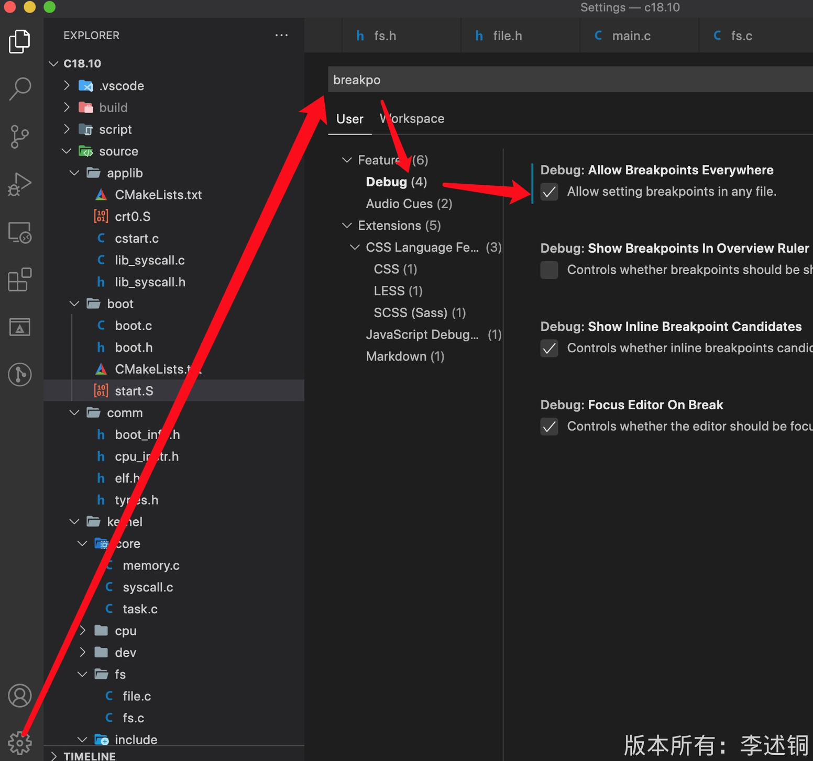

# 实现一个简单的操作系统

## 1. 搭建实验环境

### 工具安装

```
// Mac下安装
$ brew install x86_64-elf-gcc
$ brew install x86_64-elf-gdb
$ brew install cmake
brew install qemu


// Liunx下安装
$ sudo apt-get install gcc-i686-linux-gnu
$ sudo apt-get install gdb
$ sudo apt-get install cmake
$ sudo apt-get install qemu-system-x86
```

### 安装vscode插件

```
C/C++ Extension Pack  // C/C++扩展包
C/C++ // 必备
x86 and x86_64 Assembly // x86汇编语言支持
LinkerScript //提供链接脚本的语法高亮
Hex Editor // 十六进制编辑器
Makefile Tools // make文件工具
```

### 设置vscode任何文件都可以打断点



## 2. 代码分析

```
原始文件

--- scripts // 代码启动调试
--- source  // 代码
--- Makefile  // 编译文件，最终生成os.bin
--- image  // 镜像文件
```

### 链接程序分析

```
all: source/os.c source/os.h source/start.S
	$(TOOL_PREFIX)gcc $(CFLAGS) source/start.S // 编译start.S汇编文件，生成start.o文件
	$(TOOL_PREFIX)gcc $(CFLAGS) source/os.c	 // 编译os.cC语言文件,生成os.o文件
	$(TOOL_PREFIX)ld -m elf_i386 -Ttext=0x7c00 start.o os.o -o os.elf // 将生成的.o文件进行链接,生成os.elf文件,并指定生成的代码段的内存地址是0x7c00
	${TOOL_PREFIX}objcopy -O binary os.elf os.bin // 复制成为os.bin文件
	${TOOL_PREFIX}objdump -x -d -S  os.elf > os_dis.txt	 // 头部文件内容输出
	${TOOL_PREFIX}readelf -a  os.elf > os_elf.txt	 // 头部文件内容输出
	dd if=os.bin of=../image/disk.img conv=notrunc // 将os.bin 写入到disk.img文件中，不截短输出文件

```
 ***目的: 将代码段放置到0x7c00处，qemu会从这个内存的这个地方读取***

### 让计算机跑我们的程序


